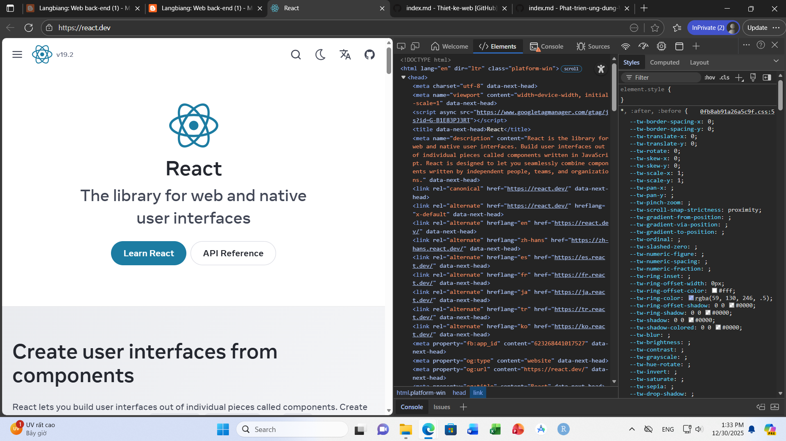
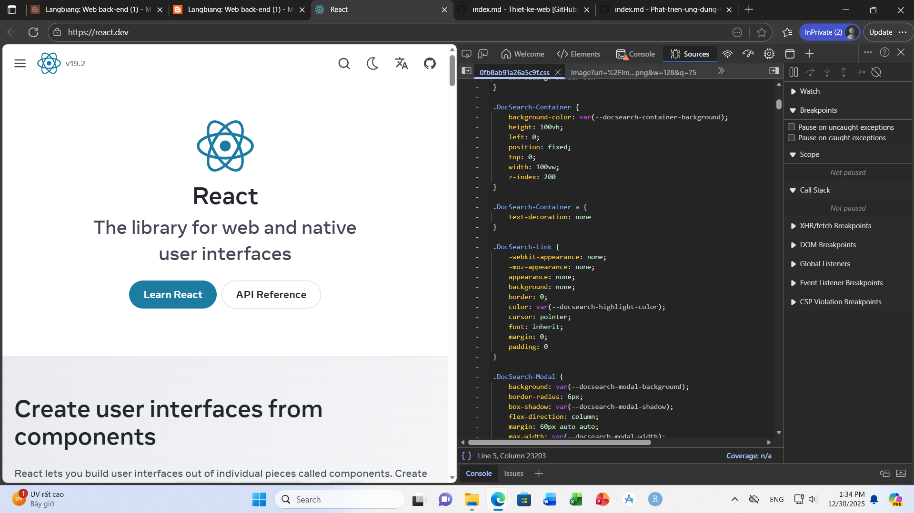
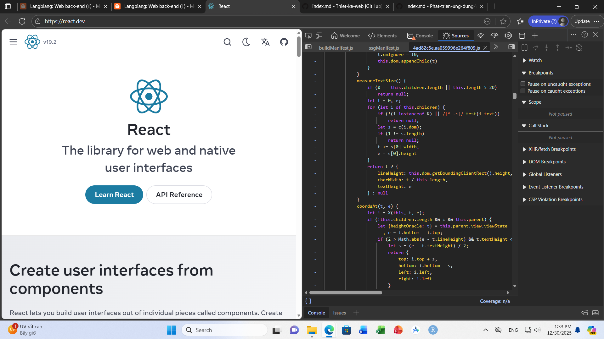

# Chương 1. Web back-end - Một số khái niệm

## 1.5 Bài tập

<b>Câu 1.1 Liệt kê 3 gói thuê bao (tên gói, giá tiền) của 3 nhà cung cấp kết nối Internet tại Việt Nam.</b>

| Nhà cung cấp | Tên gói   | Dung lượng | Giá cước (VNĐ) |
|--------------|-----------|------------|----------------|
| FPT Telecom  | Super 25  | 25Mbps     | 190.000        |
| FPT Telecom  | Super 45  | 45Mbps     | 200.000        |
| VNPT         | Home 1    | 30Mbps     | 165.000        |
| VNPT         | Home 2    | 50Mbps     | 180.000        |
| Viettel      | NET1PLUS  | 40Mbps     | 165.000        |
| Viettel      | NET2PLUS  | 80Mbps     | 180.000        |

<b>Câu 1.2 Sử dụng trình duyệt để xem mã nguồn của trang web https://react.dev. Chỉ ra được đâu là mã HTML,CSS và JavaScript. Ngoài HTML, CSS, và JavaScript, bạn có biết được lập trình viên đã sử dụng ngôn ngữ lập trình nào ở phía server để tạo ra trang https://react.dev không? Tại sao?</b>

<em>Đoạn mã HTML của trang web https://react.dev</em>

  

<em>Đoạn mã CSS của trang web https://react.dev</em>

  

<em>Đoạn mã JavaScript của trang web https://react.dev</em>

  

Không thể biết chính xác lập trình viên đã sử dụng ngôn ngữ nào ở phía Server chỉ bằng cách xem mã nguồn trình duyệt. Lý do:

1. Cơ chế hoạt động của Web (Mô hình Client-Server):

Trình duyệt (Client) chỉ có khả năng hiểu và hiển thị 3 thành phần: HTML, CSS và JavaScript. Khi bạn truy cập một trang web, Server sẽ xử lý các logic phức tạp (bằng các ngôn ngữ như Java, C#, PHP, Python, Node.js...) sau đó kết quả trả về cho trình duyệt chỉ là HTML, CSS và JavaScript để hiển thị cho người dùng.

2. Tính bảo mật:

Mã nguồn phía Server (Backend code) chứa các logic nghiệp vụ quan trọng và kết nối cơ sở dữ liệu. Mã này nằm tuyệt đối trên máy chủ và không bao giờ được gửi xuống máy khách (trình duyệt). Do đó, chức năng "View Source" của trình duyệt chỉ cho thấy "kết quả" chứ không cho thấy "nguyên liệu" gốc.

<b>Câu 1.3 Phát biểu nào không đúng khi nói về web, trang web và website?</b>

A. Web là hệ thống thông tin toàn cầu

B. Web được tạo thành nhờ các trang web và sự liên kết giữa chúng

<mark>C. Một trang web chứa nhiều website</mark>

D. Một website chứa nhiều trang web có liên quan đến nhau

<b>Câu 1.4 Phát biểu nào không đúng khi nói về website và ứng dụng web?</b>

A. Không có sự phân biệt rõ ràng giữa website và ứng dụng web

B. Một website và ứng dụng web có một địa chỉ URL để truy cập

C. Website và ứng dụng web hoạt động dựa trên mô hình client-server

<mark>D. Chỉ cần sử dụng HTML và CSS là có thể tạo ra được ứng dụng web</mark>

# Chương 2. Web back-end - Tổng quan về phát triển ứng dụng web

## 2.3. Bài tập

<b>Bài 2.1 Tìm trang (web) chủ của các CMS trong lĩnh vực phát triển ứng dụng web.

- Thương mại điện tử/bán hàng: WordPress, Wix, Joomla, Drupal, Magento, Shopify 

- Hệ thống quản lý học tập: Moodle

- Blogs, thông tin, giới thiệu: Blogger, Wordpress</b>

| Tên CMS   | Trang chủ (Website)                                                                 | Ghi chú                                   |
|-----------|--------------------------------------------------------------------------------------|-------------------------------------------|
| WordPress | [wordpress.org](https://wordpress.org/)   [wordpress.com](https://wordpress.com/) | .org là mã nguồn mở (tự cài đặt).   .com là dịch vụ lưu trữ sẵn. |
| Wix       | [wix.com](https://www.wix.com/)                                                     |                                           |
| Joomla    | [joomla.org](https://www.joomla.org/)                                               |                                           |
| Drupal    | [drupal.org](https://www.drupal.org/)                                               |                                           |
| Magento   | [Magento Commerce](https://business.adobe.com/products/magento/magento-commerce.html) | Đã thuộc về Adobe Commerce.               |
| Shopify   | [shopify.com](https://www.shopify.com/)                                             |                                           |
| Moodle    | [moodle.org](https://moodle.org/)                                                   | CMS chuyên về giáo dục (LMS).             |
| Blogger   | [blogger.com](https://www.blogger.com/)                                             |                                           |

<b>Bài 2.2 Tìm các trang (web) chủ của các framework và thư viện hỗ trợ trong việc phát triển ứng dụng web.

- Frontend: jQuery, Bootstrap, D3, React, Angular, Vue, Svelte 

- Backend: Express.js (Nodejs), Django, Flask (Python), ASP.NET (C#), Spring Boot (Java), Laravel (PHP), Ruby on Rails (Ruby), Gin, Echo (Go, Golang).</b>

1. Frontend (Giao diện người dùng)

| Tên Framework / Thư viện | Trang chủ                                                                 |
|---------------------------|---------------------------------------------------------------------------|
| jQuery                    | [jquery.com](https://jquery.com/)                                        |
| Bootstrap                 | [getbootstrap.com](https://getbootstrap.com/)                            |
| D3 (D3.js)                | [d3js.org](https://d3js.org/)                                            |
| React                     | [react.dev](https://react.dev/)                                          |
| Angular                   | [angular.dev](https://angular.dev/)   [angular.io](https://angular.io/) |
| Vue (Vue.js)              | [vuejs.org](https://vuejs.org/)                                          |
| Svelte                    | [svelte.dev](https://svelte.dev/)                                        |

2. Backend (Xử lý phía máy chủ)

| Tên Framework   | Ngôn ngữ     | Trang chủ                                                                 |
|-----------------|--------------|---------------------------------------------------------------------------|
| Express.js      | Node.js      | [expressjs.com](https://expressjs.com/)                                   |
| Django          | Python       | [djangoproject.com](https://www.djangoproject.com/)                       |
| Flask           | Python       | [flask.palletsprojects.com](https://flask.palletsprojects.com/)           |
| ASP.NET         | C#           | [ASP.NET](https://dotnet.microsoft.com/apps/aspnet)                       |
| Spring Boot     | Java         | [spring.io](https://spring.io/projects/spring-boot)                       |
| Laravel         | PHP          | [laravel.com](https://laravel.com/)                                       |
| Ruby on Rails   | Ruby         | [rubyonrails.org](https://rubyonrails.org/)                               |
| Gin             | Go (Golang)  | [gin-gonic.com](https://gin-gonic.com/)                                   |
| Echo            | Go (Golang)  | [echo.labstack.com](https://echo.labstack.com/)                           |

<b>2.3 Có 3 cách để tạo ra một ứng dụng web? Phát biểu nào không đúng?</b>

A. Sử dụng CMS

B. Sử dụng framework và thư viện hỗ trợ

C. Viết thuần bằng ngôn ngữ lập trình mà không sử dụng framework, thư viện hỗ trợ

<mark>D. Sử dụng trình duyệt web</mark>

<b>2.4 Những ưu điểm khi sử dụng CMS để tạo ra ứng dụng web. Phát biểu nào không đúng?</b>

<mark>A. Cần kiến thức lập trình chuyên sâu</mark>

B. Tối ưu SEO

C. Dễ sử dụng, dễ quản lý, tiết kiệm thời gian

D. Chi phí phát triển ứng dụng thấp

<b>2.5 Những ưu điểm khi sử dụng framework và thư viện để tạo ra ứng dụng web. Phát biểu nào không đúng?</b>

A. Tăng tốc độ phát triển

B. Cải thiện chất lượng viết mã

<mark>C. Giảm khả năng bảo mật</mark >

D. Dễ dàng bảo trì và mở rộng