

# Chương 1. Một số khái niệm

## 1.5. Bài tập

<b>Câu 1.1 Liệt kê 3 gói thuê bao (tên gói, giá tiền) của 3 nhà cung cấp kết nối Internet tại Việt Nam.</b>

| Nhà cung cấp | Tên gói   | Dung lượng | Giá cước (VNĐ) |
| :--- | :--- | :--- | :--- |
| FPT Telecom  | Super 25  | 25Mbps     | 190.000        |
| FPT Telecom  | Super 45  | 45Mbps     | 200.000        |
| VNPT         | Home 1    | 30Mbps     | 165.000        |
| VNPT         | Home 2    | 50Mbps     | 180.000        |
| Viettel      | NET1PLUS  | 40Mbps     | 165.000        |
| Viettel      | NET2PLUS  | 80Mbps     | 180.000        |

<b>Câu 1.2 Sử dụng trình duyệt để xem mã nguồn của trang web https://react.dev. Chỉ ra được đâu là mã HTML, CSS và JavaScript. Ngoài HTML, CSS, và JavaScript, bạn có biết được lập trình viên đã sử dụng ngôn ngữ lập trình nào ở phía server để tạo ra trang https://react.dev không? Tại sao?</b>

<em>Đoạn mã HTML của trang web https://react.dev</em>
  

<em>Đoạn mã CSS của trang web https://react.dev</em>
  

<em>Đoạn mã JavaScript của trang web https://react.dev</em>
 

> **Trả lời:** Không thể biết chính xác lập trình viên đã sử dụng ngôn ngữ nào ở phía Server chỉ bằng cách xem mã nguồn trình duyệt.
>
> **Lý do:**
> 1.  **Cơ chế hoạt động của Web (Mô hình Client-Server):** Trình duyệt (Client) chỉ có khả năng hiểu và hiển thị 3 thành phần: HTML, CSS và JavaScript. Khi bạn truy cập một trang web, Server sẽ xử lý các logic phức tạp (bằng các ngôn ngữ như Java, C#, PHP, Python, Node.js...) sau đó kết quả trả về cho trình duyệt chỉ là HTML, CSS và JavaScript để hiển thị cho người dùng.
> 2.  **Tính bảo mật:** Mã nguồn phía Server (Backend code) chứa các logic nghiệp vụ quan trọng và kết nối cơ sở dữ liệu. Mã này nằm tuyệt đối trên máy chủ và không bao giờ được gửi xuống máy khách (trình duyệt). Do đó, chức năng "View Source" của trình duyệt chỉ cho thấy "kết quả" chứ không cho thấy "nguyên liệu" gốc.

<b>Câu 1.3 Phát biểu nào không đúng khi nói về web, trang web và website?</b>  
A. Web là hệ thống thông tin toàn cầu  
B. Web được tạo thành nhờ các trang web và sự liên kết giữa chúng  
<mark>C. Một trang web chứa nhiều website</mark>  
D. Một website chứa nhiều trang web có liên quan đến nhau

> *Giải thích: Quan hệ bao hàm bị sai. Một Website (tập hợp) chứa nhiều Trang web (phần tử con). Trang web (Web page) chỉ là một tài liệu đơn lẻ hiển thị trên trình duyệt, nó không thể chứa nhiều website bên trong nó được.*

<b>Câu 1.4 Phát biểu nào không đúng khi nói về website và ứng dụng web?</b>  
A. Không có sự phân biệt rõ ràng giữa website và ứng dụng web  
B. Một website và ứng dụng web có một địa chỉ URL để truy cập  
C. Website và ứng dụng web hoạt động dựa trên mô hình client-server  
<mark>D. Chỉ cần sử dụng HTML và CSS là có thể tạo ra được ứng dụng web</mark>

> *Giải thích: HTML và CSS chỉ tạo ra được giao diện tĩnh (Static Website). Để tạo ra "Ứng dụng web" (Web App) có khả năng tương tác, xử lý logic và dữ liệu người dùng, bắt buộc phải có ngôn ngữ lập trình (như JavaScript, PHP, Java...) và cơ sở dữ liệu.*

---

# Chương 2. Tổng quan về phát triển ứng dụng web

## 2.3. Bài tập

<b>Bài 2.1 Tìm trang (web) chủ của các CMS trong lĩnh vực phát triển ứng dụng web.</b>

| Tên CMS   | Trang chủ (Website) | Ghi chú |
| :--- | :--- | :--- |
| **WordPress** | [wordpress.org](https://wordpress.org/)   [wordpress.com](https://wordpress.com/) | .org là mã nguồn mở (tự cài đặt).   .com là dịch vụ lưu trữ sẵn. |
| **Wix** | [wix.com](https://www.wix.com/) | Nền tảng kéo thả (Drag & Drop). |
| **Joomla** | [joomla.org](https://www.joomla.org/) | |
| **Drupal** | [drupal.org](https://www.drupal.org/) | |
| **Magento** | [Magento Commerce](https://business.adobe.com/products/magento/magento-commerce.html) | Đã thuộc về Adobe Commerce. |
| **Shopify** | [shopify.com](https://www.shopify.com/) | Chuyên TMĐT (SaaS). |
| **Moodle** | [moodle.org](https://moodle.org/) | CMS chuyên về giáo dục (LMS). |
| **Blogger** | [blogger.com](https://www.blogger.com/) | |

<b>Bài 2.2 Tìm các trang (web) chủ của các framework và thư viện hỗ trợ trong việc phát triển ứng dụng web.</b>

**1. Frontend (Giao diện người dùng)**

| Tên Framework / Thư viện | Trang chủ |
| :--- | :--- |
| **jQuery** | [jquery.com](https://jquery.com/) |
| **Bootstrap** | [getbootstrap.com](https://getbootstrap.com/) |
| **D3 (D3.js)** | [d3js.org](https://d3js.org/) |
| **React** | [react.dev](https://react.dev/) |
| **Angular** | [angular.dev](https://angular.dev/)   [angular.io](https://angular.io/) |
| **Vue (Vue.js)** | [vuejs.org](https://vuejs.org/) |
| **Svelte** | [svelte.dev](https://svelte.dev/) |

**2. Backend (Xử lý phía máy chủ)**

| Tên Framework | Ngôn ngữ | Trang chủ |
| :--- | :--- | :--- |
| **Express.js** | Node.js | [expressjs.com](https://expressjs.com/) |
| **Django** | Python | [djangoproject.com](https://www.djangoproject.com/) |
| **Flask** | Python | [flask.palletsprojects.com](https://flask.palletsprojects.com/) |
| **ASP.NET** | C# | [dotnet.microsoft.com](https://dotnet.microsoft.com/apps/aspnet) |
| **Spring Boot** | Java | [spring.io](https://spring.io/projects/spring-boot) |
| **Laravel** | PHP | [laravel.com](https://laravel.com/) |
| **Ruby on Rails** | Ruby | [rubyonrails.org](https://rubyonrails.org/) |
| **Gin** | Go (Golang) | [gin-gonic.com](https://gin-gonic.com/) |
| **Echo** | Go (Golang) | [echo.labstack.com](https://echo.labstack.com/) |

<b>Câu 2.3 Có 3 cách để tạo ra một ứng dụng web? Phát biểu nào không đúng?</b>  
A. Sử dụng CMS  
B. Sử dụng framework và thư viện hỗ trợ  
C. Viết thuần bằng ngôn ngữ lập trình mà không sử dụng framework, thư viện hỗ trợ  
<mark>D. Sử dụng trình duyệt web</mark>

> *Giải thích: Trình duyệt web (như Chrome, Firefox) là môi trường để thực thi (run) và hiển thị ứng dụng phía Client, không phải là công cụ hay phương pháp để xây dựng (build/create) mã nguồn phần mềm.*

<b>Câu 2.4 Những ưu điểm khi sử dụng CMS để tạo ra ứng dụng web. Phát biểu nào không đúng?</b>  
<mark>A. Cần kiến thức lập trình chuyên sâu</mark>  
B. Tối ưu SEO  
C. Dễ sử dụng, dễ quản lý, tiết kiệm thời gian  
D. Chi phí phát triển ứng dụng thấp

> *Giải thích: CMS (Hệ quản trị nội dung) sinh ra để giúp người dùng có thể tạo và quản lý website mà không cần (hoặc cần rất ít) kiến thức lập trình. Yêu cầu kiến thức chuyên sâu là đặc điểm của việc tự viết code (coding from scratch).*

<b>Câu 2.5 Những ưu điểm khi sử dụng framework và thư viện để tạo ra ứng dụng web. Phát biểu nào không đúng?</b>  
A. Tăng tốc độ phát triển  
B. Cải thiện chất lượng viết mã  
<mark>C. Giảm khả năng bảo mật</mark>  
D. Dễ dàng bảo trì và mở rộng

> *Giải thích: Framework thường cung cấp các lớp bảo mật mặc định để chống lại các lỗi phổ biến (như SQL Injection, XSS, CSRF). Do đó, sử dụng Framework đúng cách sẽ giúp tăng cường bảo mật chứ không phải làm giảm đi.*

---

# Chương 3. Web server

## 3.3 Bài tập

<b>Bài 3.1 Thực hành lại các cài đặt trong bài học.</b>

* **Cài đặt Nginx:**
[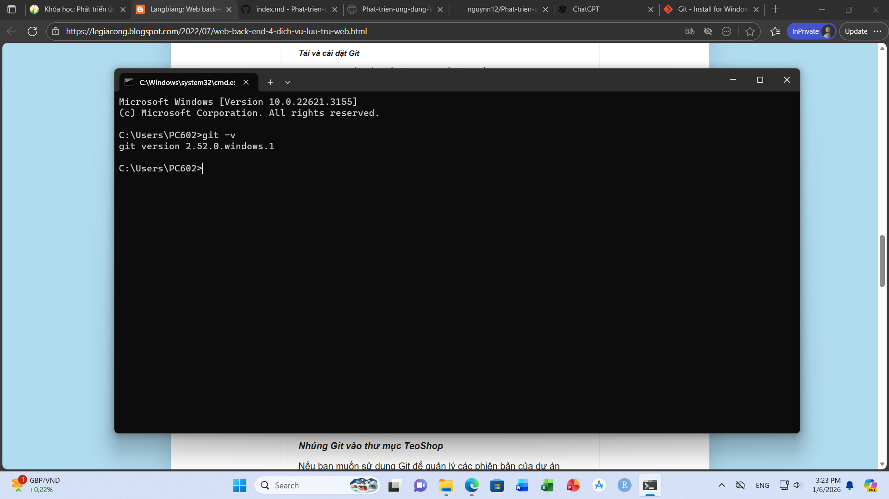](Image/3.1.png)

* **Kiểm tra tiến trình trong Task Manager:**

* **Một số lệnh của Nginx:**

* **Tắt Nginx:**

* **Web server sử dụng Nginx:**

* **Đổi cổng kết nối:**

[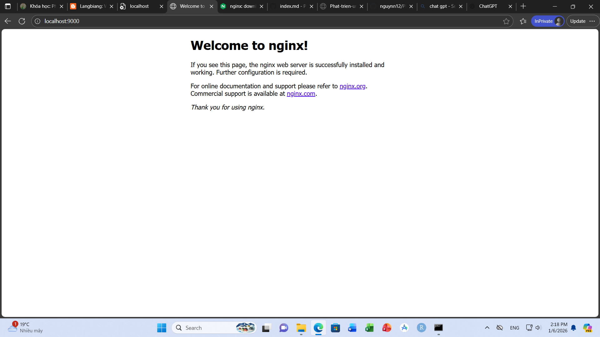](Image/3.7.png)

* **Thay đổi nội dung trang web:**
[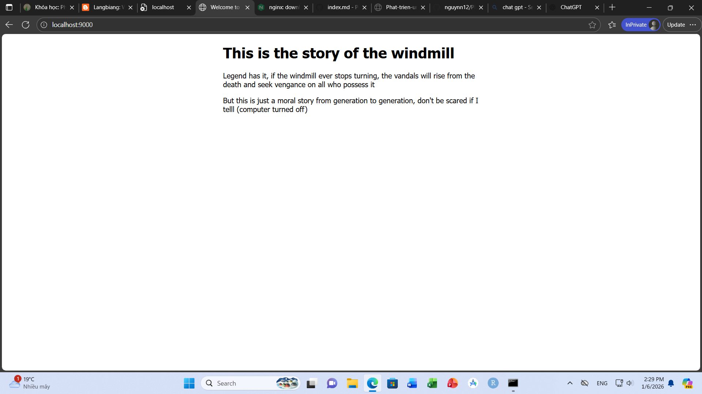](Image/3.8.png)

<b>Câu 3.2 Một số phần mềm web server phổ biến. Phát biểu nào không đúng?</b>  
A. Apache  
B. Nginx  
<mark>C. SSI</mark>  
D. Nodejs

<b>Câu 3.3 Các chức năng của Web server là gì. Phát biểu nào không đúng?</b>  
A. Lưu trữ các tập tin của ứng dụng web  
B. Nhận request từ client  
C. Xử lý request  
<mark>D. Nhận response từ máy client</mark>

<b>Bài tập 3.4 Thực hiện một số cấu hình cho Nginx:</b>

* (a) Lắng nghe trên cổng 65535
* (b) Trỏ web root về một thư mục khác ổ đĩa `C:\` (ví dụ: `D:\TeoShop`)
* (c) Tạo tập tin `index.py` để kiểm tra tập tin mặc định.
* **(d) Lắng nghe trên cổng 65536 được không? Tại sao?**

> **Trả lời:** Cổng mạng (port) trong giao thức TCP/UDP được định danh bằng 16-bit, có giá trị từ **0 đến 65535**. Vì vậy, cổng **65536** vượt qua phạm vi hợp lệ và sẽ không thể sử dụng được.

---

# Chương 4. Ứng dụng web bán hàng

<b>Bài tập 4.1 Thực hành các cài đặt trong bài học.</b>

* **Kiểm tra phiên bản Git:**

* **Cài đặt Git vào thư mục dự án:**
[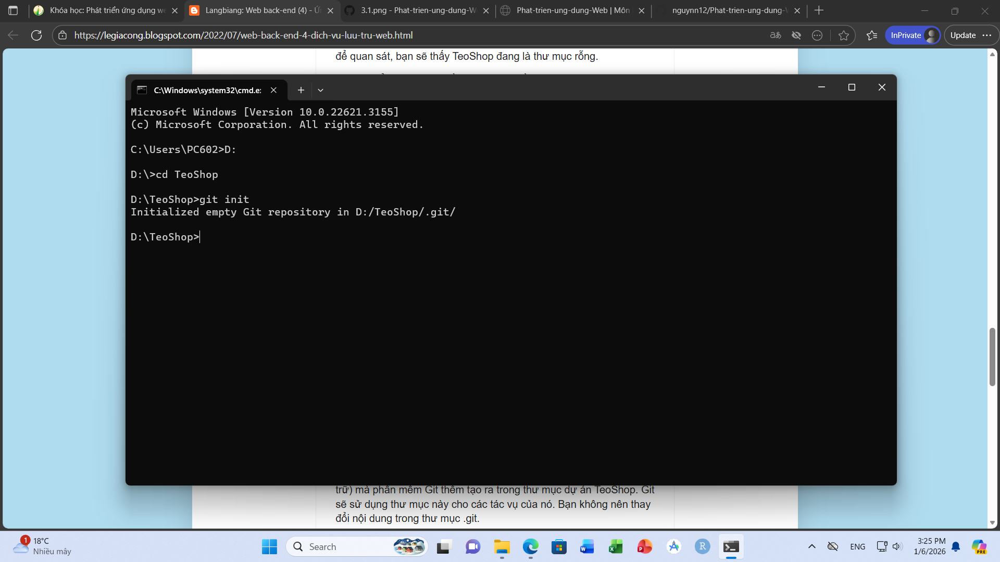](Image/4.2.png)

<b>Câu 4.2 Lệnh nào được sử dụng để nhúng Git vào thư mục dự án?</b>  
<mark>A. git init</mark>  
B. git --init  
C. git initialize  
D. git embed

<b>Câu 4.3 Lệnh nào sử dụng để kiểm tra trên máy tính đã có phần mềm Git hay chưa?</b>  
A. git ver  
B. git version  
<mark>C. git --version hoặc git -v</mark>  
D. git --ver

<b>Câu 4.4 Trong Git, kho lưu trữ (repo, repository) là gì?</b>  
A. Là thư mục dự án  
<mark>B. Là thư mục dự án đã được nhúng Git</mark>  
C. Là thư mục cài đặt phần mềm Git  
D. Là thư mục .git (trong thư mục dự án)

<b>Câu 4.5 Bạn có thể sử dụng các công cụ sau để viết mã. Phát biểu nào không đúng?</b>  
A. Text editor  
<mark>B. MS Word</mark>  
C. IDE, Code Editor  
D. Chatbot (Gemini), Trang web (https://codepen.io/)

---

# Chương 5. Nodejs và NPM

<b>Bài tập 5.1 Tải và cài đặt Nodejs, NPM trên máy tính. Kiểm tra để đảm bảo Nodejs và NPM sẵn sàng sử dụng.</b>
[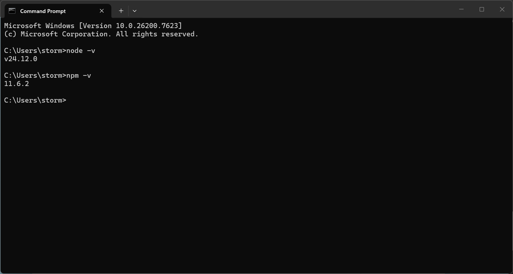](Image/5.1.png)

<b>Câu 5.2 Nodejs là gì? Phát biểu nào không đúng?</b>  
A. Nodejs là môi trường phát triển ứng dụng  
<mark>B. Nodejs là một ngôn ngữ lập trình</mark>  
C. Nodejs là nền tảng phát triển ứng dụng  
D. Có thể sử dụng Nodejs để tạo web server

<b>Câu 5.3 NPM là gì? Phát biểu nào không đúng?</b>  
A. NPM là viết tắt của Node Package Manager  
B. NPM là công cụ để quản lý các thư viện dùng trong một ứng dụng chạy trên nền Nodejs  
C. NPM được cài đặt mặc định khi cài đặt Nodejs  
<mark>D. NPM gồm 3 thành phần: website, GUI và registry</mark>

---

# Chương 6. Cấu hình Web server trong Nodejs

<b>Bài tập 6.1 Thực hiện các cài đặt, cấu hình trong bài học.</b>

* **Package.json:** [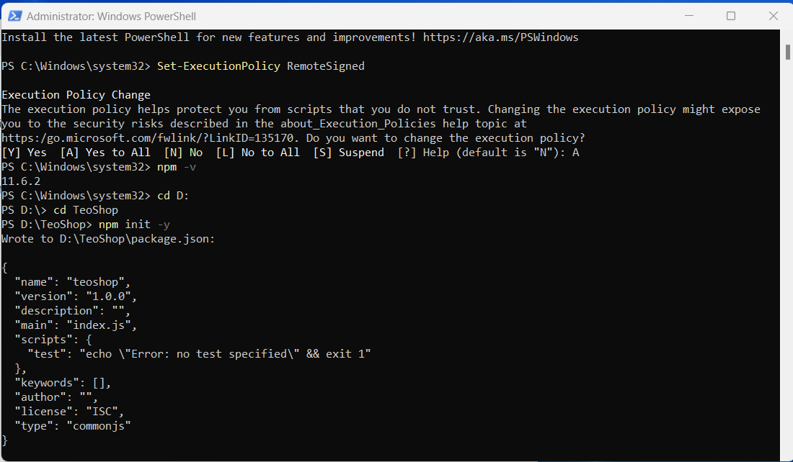](Image/6.1.png)
* **Cài đặt PNPM:** [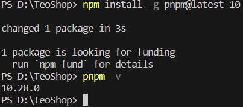](Image/6.2.png)
* **Chạy tập tin index.js:** [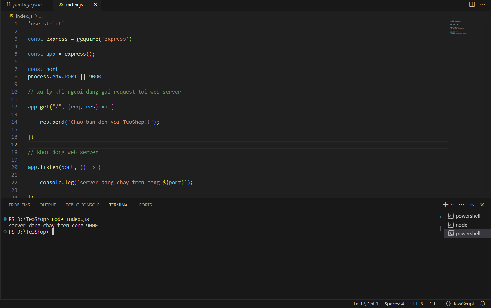](Image/6.3.png)
* **Cài đặt Nodemon:** [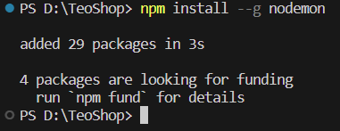](Image/6.4.png)
* **Sử dụng Nodemon:** [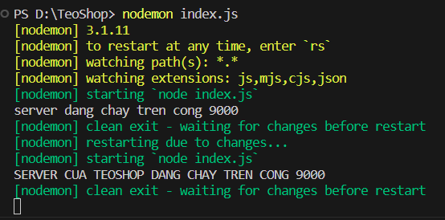](Image/6.5.png)

> *Link tài liệu thực hành: [Click here](https://drive.google.com/drive/u/2/folders/1SLn_8MV9Wh72W1Ja0-DV2bNh-S3l0Nmv)*

<b>Bài tập 6.2 Làm sao biết được một gói cài đặt ở chế độ cục bộ (locally) hay toàn cục (globally)? Khi cài đặt các gói (package) ở chế độ cục bộ và toàn cục (globally) thì các gói sẽ được lưu ở đâu? Làm sao bạn biết được?</b>

> **1. Cài đặt gói ở chế độ cục bộ (local)**
> * **Lệnh:** `npm install <tên-gói>`
> * **Nơi lưu:** Trong thư mục `node_modules` của chính dự án.
> * **Phạm vi:** Chỉ dùng được trong dự án đó (ví dụ: `express`, `mongoose`).
> * **Cách kiểm tra:** Xem thư mục `node_modules` hoặc gõ `npm list <tên-gói>`.

> **2. Cài đặt gói ở chế độ toàn cục (global)**
> * **Lệnh:** `npm install -g <tên-gói>`
> * **Nơi lưu:** Thư mục hệ thống (Windows: `AppData`, Mac/Linux: `/usr/local/lib`).
> * **Phạm vi:** Dùng chung cho mọi dự án (thường là công cụ CLI như `nodemon`, `npm`, `pnpm`).
> * **Cách kiểm tra:** Gõ `npm list -g <tên-gói>` hoặc `where <tên-gói>`.

<b>Bài tập 6.3 Sự khác nhau khi cài đặt gói ở chế độ dependencies và devDependencies?</b>

| Đặc điểm | dependencies | devDependencies |
| :--- | :--- | :--- |
| **Mục đích** | Các gói cần thiết để ứng dụng hoạt động **thực tế** (Production). | Các gói chỉ phục vụ cho quá trình **phát triển** (Development). |
| **Lệnh cài** | `npm install <tên-gói>` | `npm install <tên-gói> --save-dev` |
| **Ví dụ** | `express`, `react`, `axios`. | `nodemon`, `jest`, `eslint`. |
| **Vai trò** | Nếu thiếu, ứng dụng sẽ bị lỗi, không chạy được. | Giúp lập trình viên code nhanh hơn, không cần thiết khi chạy thật. |

<b>Câu 6.4 Trong ứng dụng chạy trên nền Nodejs, tập tin package.json dùng để làm gì? Phát biểu nào không đúng?</b>  
A. Chứa thông tin mô tả về ứng dụng  
B. Quản lý các phụ thuộc  
C. Chỉ ra tập tin JavaScript đầu tiên được thực thi  
<mark>D. Chứa mã để tạo giao diện ứng dụng</mark>

<b>Câu 6.5 PNPM là gì? Phát biểu nào không đúng?</b>  
A. Giúp tiết kiệm dung lượng đĩa  
B. Có thể thay thế hoặc bổ sung cho NPM  
C. Là viết tắt của Performant Node Package Manager  
<mark>D. Không thể thay thế hoặc bổ sung cho NPM</mark>

<b>Câu 6.6 Express trong Node.js được sử dụng để làm gì?</b>  
<mark>A. Tạo ứng dụng web và API</mark>  
B. Quản lý cơ sở dữ liệu  
C. Thiết kế giao diện người dùng  
D. Kiểm tra hiệu suất ứng dụng

<b>Câu 6.7 Nodemon trong Node.js được sử dụng để làm gì?</b>  
A. Kết nối với cơ sở dữ liệu  
B. Tạo giao diện người dùng cho ứng dụng  
C. Quản lý các gói phụ thuộc  
<mark>D. Tự động khởi động lại server khi mã thay đổi</mark>

---

# Chương 7. Local và Global, Dependencies và devDependencies

<b>Bài tập 7.1 Thực hiện các cài đặt trong bài học.</b>

* **Cài đặt cục bộ:** 
[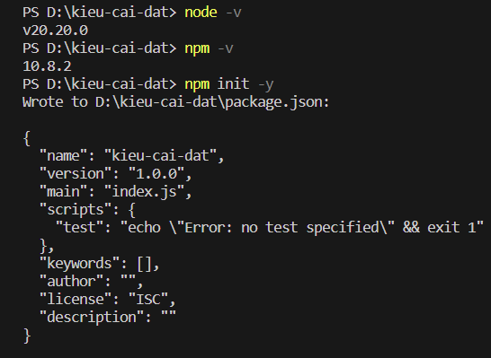](Image/7.1.png) 

[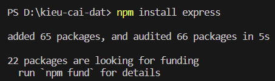](Image/7.2.png)

* **Gỡ bỏ gói cục bộ:** 
[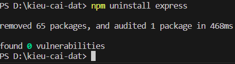](Image/7.3.png)

* **Cài đặt toàn cục:** 
[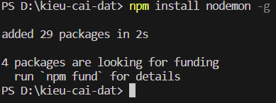](Image/7.4.png)

* **Kiểm tra vị trí gói toàn cục:** [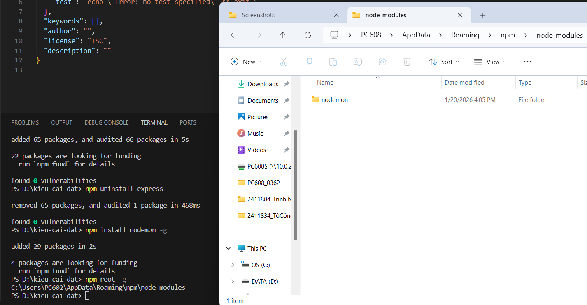](Image/7.5.png)
* **Xem tất cả gói đã cài:** [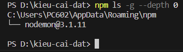](Image/7.6.png)

> *Link tài liệu thực hành: [Click here](https://drive.google.com/drive/u/2/folders/1SLn_8MV9Wh72W1Ja0-DV2bNh-S3l0Nmv)*

<b>Câu 7.2 Trong môi trường phát triển ứng dụng Nodejs, phát biểu nào không đúng khi nói về gói cục bộ?</b>  
A. Gói cục bộ được cài đặt trong thư mục node_modules của dự án  
B. Gói cục bộ chỉ có thể được sử dụng trong dự án mà nó được cài đặt  
C. Gói cục bộ được quản lý thông qua file package.json và có thể sử dụng các phiên bản khác nhau giữa các dự án  
<mark>D. Gói cục bộ luôn được cài đặt toàn cục trên hệ thống để tất cả các dự án đều có thể truy cập</mark>

> *Giải thích: Đây là đặc điểm của gói toàn cục (Global Package). Gói cục bộ (Local Package) được cài riêng biệt trong từng dự án để tránh xung đột phiên bản.*

<b>Câu 7.3 Trong môi trường phát triển ứng dụng Nodejs, phát biểu nào không đúng khi nói về gói toàn cục?</b>  
<mark>A. Gói toàn cục luôn được liệt kê trong tập tin package.json của dự án</mark>  
B. Gói toàn cục thường được sử dụng cho các công cụ dòng lệnh (CLI) như nodemon  
C. Gói toàn cục được lưu trong thư mục toàn cục của hệ thống và có thể truy cập từ bất kỳ dự án nào  
D. Gói toàn cục được cài đặt bằng lệnh npm install -g <package-name>

> *Giải thích: Gói toàn cục được cài đặt vào thư mục hệ thống của máy tính, nó không tự động được thêm vào danh sách dependencies trong file `package.json` của một dự án cụ thể.*

<b>Câu 7.4 Trong môi trường phát triển ứng dụng Nodejs, phát biểu nào không đúng khi nói về kiểu cài đặt dependencies?</b>  
A. Các gói trong dependencies được cài đặt cục bộ trong dự án bằng lệnh npm install <package-name>  
B. Các gói trong dependencies là các phụ thuộc cần thiết để ứng dụng chạy trong môi trường triển khai, sản xuất (production)  
<mark>C. Các gói trong dependencies chỉ được sử dụng trong giai đoạn phát triển và không cần thiết khi triển khai ứng dụng (production)</mark>  
D. Các gói trong dependencies được liệt kê trong tập tin package.json và tự động cài đặt khi chạy npm install

> *Giải thích: Các gói trong `dependencies` là các thư viện bắt buộc phải có để ứng dụng hoạt động (Runtime dependencies), ví dụ như Express, React, Mongoose. Nếu thiếu chúng ở môi trường Production, ứng dụng sẽ lỗi.*

<b>Câu 7.5 Trong môi trường phát triển ứng dụng Nodejs, phát biểu nào không đúng khi nói về kiểu cài đặt devDependencies?</b>  
A. Các gói trong devDependencies được cài đặt bằng lệnh npm install <package-name> --save-dev  
<mark>B. Các gói trong devDependencies là các phụ thuộc cốt lõi để ứng dụng chạy trong môi trường triển khai (production)</mark>  
C. Các gói trong devDependencies chỉ cần thiết trong giai đoạn phát triển hoặc kiểm thử, không cần cho môi trường triển khai (production)  
D. Các gói trong devDependencies không được cài đặt khi chạy npm install --production

> *Giải thích: `devDependencies` chỉ chứa các công cụ hỗ trợ quá trình phát triển (như Nodemon, Jest, ESLint). Khi deploy lên Production, để tối ưu hiệu năng và dung lượng, ta thường bỏ qua các gói này.*

# Chương 8. Lập trình đồng bộ, hàm ẩn danh trong JavaScript

# Chương 9. Hàm mũi tên, lập trình bất đồng bộ trong JavaScript

# Chương 10. Hàm callback